# Hi, I'm Ehsan! 👋

I am a dedicated software development student currently focused on mastering **Backend Development**. I enjoy solving problems and building the foundation of web applications. My ultimate goal is to become a proficient **Full-stack Developer**.

# Skills & Tools

### 🌱 I’m currently learning ...
- [*] **Phase 1:** Mastering **Django** for robust backend services.
- [ ] **Phase 2:** Learning **JavaScript** and **React** for modern frontend interfaces.
- [ ] **Phase 3:** Building my first comprehensive **Full-stack** project.

### 🛠 Tools & Technologies

  

---
*"Every commit is a step toward mastery. ( 2026/1/5 )"*
